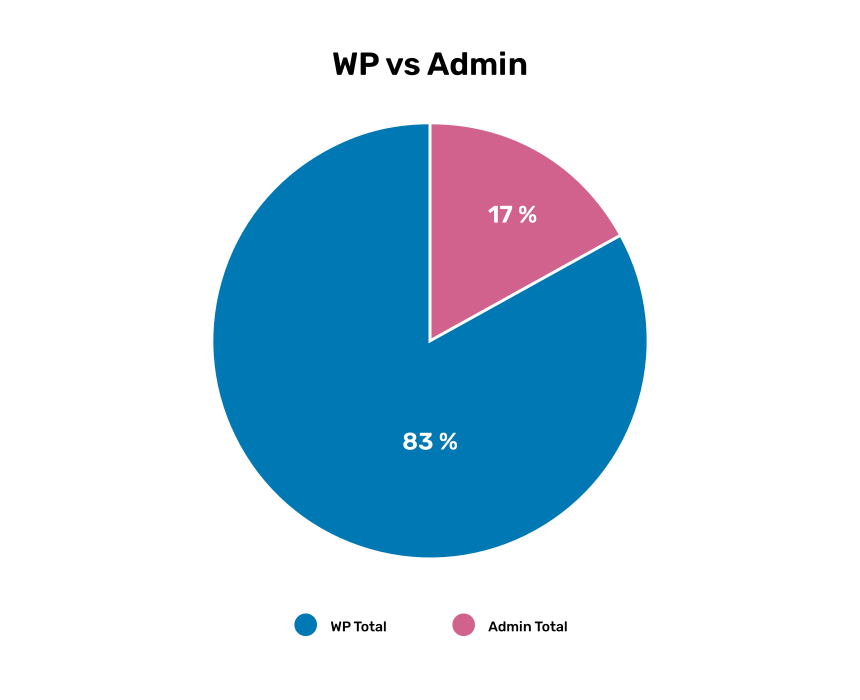
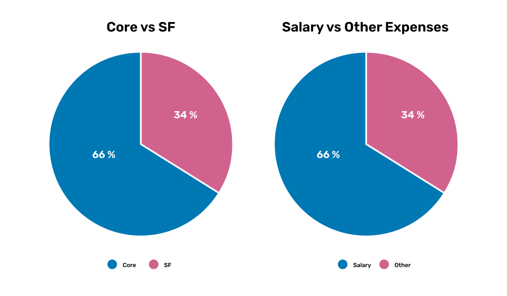

[[budget]]
== Indicative Budget for 2024

This draft budget offers a broad, preliminary overview of expected GBIF income and expenses in 2024. It includes funds for Work Programme activities as well as Secretariat administration and governance, and it delineates funding from basic financial contributions (core) and supplementary funds.

The WP24 budget includes supplementary contributions from Participants to Special Purpose Funds (SPF)  Priority Area 3. We encourage Participants who are able to commit funds beyond the basic financial contribution, to consider contributing to a Special Purpose Fund and accelerate GBIF’s work in one or more of our Priority Areas.

=== Work Programme 2024

In 2024, the Secretariat expects to receive 4.2 million euros in income from basic financial contributions, mainly from Voting Participants, and will earn 1.7 million euros in supplementary funds.

The expenses in the draft 2024 budget total 5.9 million euros, with nearly 5 million euros going towards Work Programme 2024 (<<figure-graph1,Figure 1>>) and the remainder for administration and governance. This total includes both core and supplementary fund expenditures.

[#figure-graph1]
.Expected Secretariat expenses for Work Programme and Secretariat administration and governance.

The draft 2024 budget includes expenses for staff salaries, external contractors, and non-salary expenses for meetings and travel. This total reflects expenditures from both core and supplementary funds. Supplementary funds enable 50 per cent more total WP activities. Two thirds of the 2024 expenses are staff salaries (<<figure-graph2,Figure 2>>).

[#figure-graph2]
.Expected breakdown of Work Programme expenses.

All four Priority Area budgets include costs for staff salary, external contracts, and non-salary expenses such as meetings and travel. The largest expense in all Priority Areas is staff salary. The expected of WP expenses are highest for Priority Area 3 and Priority Area 4 (<<figure-graph3,Figure 3>>).

[#figure-graph3]
.Work Programme 2024 expense breakdown across the four Priority Areas.

